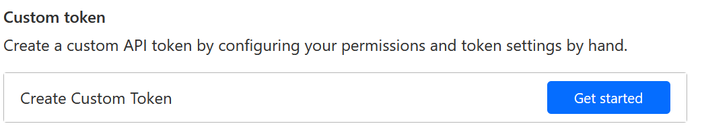

# Installing Cloudflare tunnels

## Create API token

Go to the [Cloudflare dashboard](https://dash.cloudflare.com/profile/api-tokens)

Click on "Create Token"

Click on "Create Custom Token"

Type a name for the token and select the following permissions for the token:
- Account: Cloudflare Tunnel: Edit
- Account: DNS Views: Read
- Zone: DNS: Edit
 

As shown on the screenshot

You can leave other fields as default, or set restrictions to what zones and accounts the token can access.

Press "Continue to summary" and then "Create Token". 

You will be shown the token, copy it and save it somewhere safe. You will not be able to see it again.

## Register or move domain

You can either register a new domain with Cloudflare or move an existing domain to Cloudflare.
This domain will be used to access your server.

Open the [Cloudflare dashboard](https://dash.cloudflare.com/?to=/:account/home) and follow the instructions to add a new site or move an existing one.

## Install cloudflare-tunnel application

In the Frierun web interface select `cloudflare-tunnel` from the list of provider packages and press `Install`.

Enter the API token you created earlier.

## Use it

You can now expose other applications to the internet using Cloudflare tunnels. When installing other application, select `Cloudflare` as Http endpoint.

