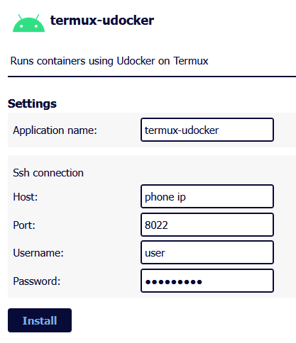

# Android Termux

Install Termux either from [Google Play](https://play.google.com/store/apps/details?id=com.termux) or [F-Droid](https://f-droid.org/en/packages/com.termux/). Run it.

There are two ways to use Frierun: with `docker` or `udocker`(https://github.com/indigo-dc/udocker).

## Docker

It is the recommended way.

You can either create [a virtual machine with docker](https://github.com/cyberkernelofficial/docker-in-termux) — no root required, but it works slower.

Or install it [on the rooted device](https://gist.github.com/FreddieOliveira/efe850df7ff3951cb62d74bd770dce27).

After that, follow our [original guidelines about docker](https://github.com/frierun/frierun?tab=readme-ov-file#docker).

## Udocker

> [!IMPORTANT]
> Udocker doesn't fully support docker containers. Most of the packages won't work. See https://github.com/frierun/frierun/issues/22

Install the ssh daemon (see https://wiki.termux.com/wiki/Remote_Access for more information):
```bash
pkg upgrade
pkg install openssh termux-services
sv-enable sshd
```

Set the user password:
```bash
passwd
```

Install the udocker package:
```bash
pkg install udocker
```

Frierun can be installed on the `udocker` or on another server with `docker`.

If you choose to install it on the `udocker`, use the following command:
```bash
mkdir -p /data/data/com.termux/files/home/frierun/config
udocker run \
  --name=frierun \
  --publish=8080:8080 \
  --volume=/data/data/com.termux/files/home/frierun/config:/App/Frierun \
  ghcr.io/frierun/frierun:latest
```

Open the Frierun web GUI. It would be on http://[phone ip]:8080. 

Choose package `termux-udocker` and install it.



Fill in the details. Default username is `user`. Default port is `8022`.

## Final notes on udocker

Udocker mimics a small set of docker functionality. It can't run complicated setups. Most of the packages won't work.

For each container Frierun creates a service using `termux-services`. You can check their status via `sv status [application name]` .